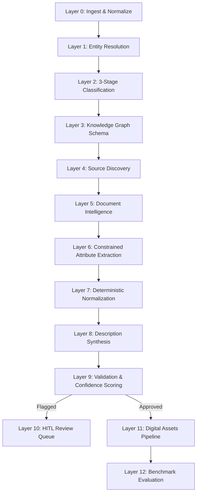

# UniHAP — Product Intelligence Enrichment Pipeline

[](https://www.python.org/downloads/)
[](https://github.com/astral-sh/uv)
[](https://pydantic.dev/)
[](https://groq.com/)
[](#)

> **UniHAP** is an enterprise-grade, evidence-grounded product catalog intelligence and attribute enrichment pipeline. Built on a strict **12-layer zero-hallucination architecture**, UniHAP guarantees that no product attribute or description fact is generated without citable evidence spans from official manufacturer sources.

---

## 🏛️ Pipeline Architecture (12 Layers)



### Layer Summary

| # | Layer | Core Function | Tooling & Implementation | Cost Tier |
|---|---|---|---|---|
| **0** | **Ingest / Normalize** | Clean messy XLSX/CSV, resolve merged cells & multi-row headers, strip placeholders (`-- Unbranded --` etc.) | `pandas`, `openpyxl` | Free |
| **1** | **Entity Resolution** | Fuzzy-match `Part_Manuf`/brand against canonical dictionary (27k list) | `rapidfuzz`, `sentence-transformers` | Free (Local) |
| **2** | **Classification** | 3-stage funnel: (a) LOV keywords, (b) Cosine embeddings, (c) LLM tie-break on ambiguous rows | `sentence-transformers` + Groq API | Mostly Free |
| **3** | **Knowledge Graph** | Classpath → Attribute → AllowedValue → UOM schema; many-to-one synonym edges | `NetworkX` / `Neo4j` | Free |
| **4** | **Source Discovery** | Resolve official root domain (Wikidata) & discover spec URL (Firecrawl search/map) | Wikidata API + `firecrawl-py` | Low |
| **5** | **Document Intelligence** | Fetch official page → clean Markdown/tables; VLM pass for scanned drawings/nameplates | `Crawl4AI` + Multimodal VLM | Free (+compute) |
| **6** | **Attribute Extraction** | Constrained RAG: extract LOV-only values with mandatory `evidence_span`; abstain if missing | Groq LLaMA-3.3-70B (JSON mode) | Low |
| **7** | **Normalization** | Static lookup tables: UOM abbreviations (~500), fraction↔decimal (63-row), house-style | Pure Python lookup tables | Free |
| **8** | **Description Synthesis** | 5 compliant formats (Invoice ≤40 CAPS, Mobile 60-80, Short, Long, Retail) strictly from validated attrs | Deterministic templates + Groq | Low |
| **9** | **Validation / Confidence** | Check schema validity, LOV bounds, char limits, provenance → `auto-approved` / `needs-review` / `rejected` | `Pydantic v2` rules engine | Free |
| **10** | **Human-in-the-Loop** | Curate review queue for flagged fields with source diff view; feedback loops to few-shot cache | `Streamlit` Review Dashboard | Free |
| **11** | **Digital Assets** | Manufacturer-only image & PDF spec sheet retrieval with VLM visual verification | `Crawl4AI` + VLM verification | Low |
| **12** | **Evaluation & Scoring** | Score accuracy, LOV conformance %, fill rates, provenance coverage % against 200-row ground truth | Python evaluation engine | Free |

---

## ⚡ Technical Requirements & Stack

- **Runtime**: Python 3.11+ managed with **`uv`** (fastest Python package manager)
- **Data Ingestion**: `pandas`, `openpyxl`
- **Matching & Embeddings**: `rapidfuzz`, `sentence-transformers` (`all-MiniLM-L6-v2`)
- **LLM Tier (Cascade)**:
  1. *Local Tier*: `Ollama` + `Gemma 3 4B` (short-prompt, low-ambiguity, zero-cost, private)
  2. *Cloud Tier*: `Groq API` (`llama-3.3-70b-versatile`) for structured JSON-schema attribute extraction & tie-breaks
- **Web Discovery & Scraping**: `Wikidata REST API`, `Firecrawl API`, `Crawl4AI` (self-hosted Playwright/Chromium)
- **Knowledge Graph**: `NetworkX` (in-memory) & `Neo4j` (optional external cluster)
- **Validation**: `Pydantic v2`
- **UI & CLI**: `Streamlit`, `Typer`, `Rich`

---

## 🚀 Quickstart & Installation (using `uv`)

### 1. Clone & Install Dependencies
```bash
git clone https://github.com/Mani212005/unihap.git
cd unihap

# Install dependencies using uv
uv sync
```

### 2. Configure Environment
```bash
cp .env.example .env
# Add your GROQ_API_KEY and FIRECRAWL_API_KEY to .env
```

### 3. Run Pipeline via CLI
```bash
# Run 12-layer pipeline on sample catalog
uv run unihap run data/raw/sample_catalog.csv

# View system configuration and LLM cascade
uv run unihap info
```

### 4. Launch Human-in-the-Loop Streamlit UI
```bash
uv run unihap ui
```

---

## 🔒 Hard Sourcing Filter

> **Sourcing Rule**: Official manufacturer domains ONLY. Marketplaces and distributor domains (`amazon.com`, `ebay.com`, `homedepot.com`, `lowes.com`, `ferguson.com`, etc.) are blocklisted in code and never trusted for factual attribute grounding.

---

## 📊 Evaluation & Ground Truth Metrics

The pipeline automatically evaluates performance against the 200-row benchmark:
- **Field-level exact/near-match accuracy**
- **LOV Conformance %** (controlled vocabulary compliance)
- **Character limit compliance** (e.g. Invoice description ≤ 40 characters)
- **Required-attribute fill rate**
- **Provenance coverage %** (percentage of values backed by verified source spans)
- **Confidence tier distribution** (`auto-approved` / `needs-review` / `rejected`)

---

## 📚 Documentation & Team Guidelines

All architectural, operational, and team collaboration specifications reside in the [`docs/`](docs/) directory:

- 📋 [**Team & Contribution Rules**](docs/rules.md) — Non-negotiable architectural invariants, zero-hallucination rules, git workflow, and coding standards for all contributors.
- 🔄 [**Operational & Developer Workflow**](docs/WORKFLOW.md) — Sequence diagrams, operator guides, HITL curation flow, and developer runbooks.
- 📜 [**Changelog**](docs/CHANGELOG.md) — Release notes and version history (v0.1.0 initial release).
- 📝 [**Full Technical Specification**](docs/spec.md) — 12-layer technical specification, cost models, and prior art validation.
- 🏛️ [**Architecture Guide**](docs/architecture.md) — LLM cascade, controlled LOV graph schema, and confidence gating.
- ⚡ [**Tech Stack & Requirements**](docs/tech_stack.md) — Complete runtime packages and dependency requirements.

---

## 📜 License
Proprietary & Confidential — UniHAP Enterprise.
