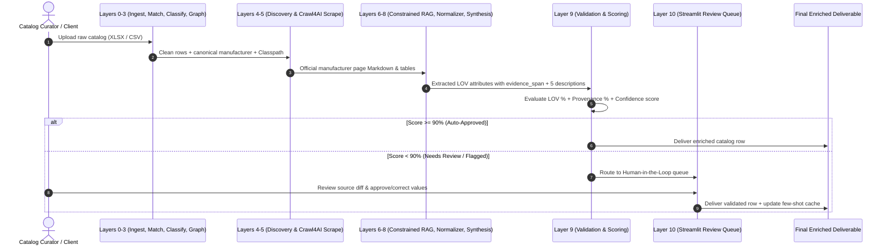

# UniHAP Operational & Developer Workflow

Welcome to the **UniHAP** workflow guide. This document explains how the end-to-end product enrichment pipeline operates, how data flows through each layer, and how developers and catalog curators interact with the system.

---

## 🔄 End-to-End Operational Workflow



---

## 📋 Step-by-Step Operator Guide

### 1. Ingestion & Pre-Flight Cleaning (`Layer 0`)
- **Input**: Messy supplier Excel/CSV files with merged cells, multi-row headers, or missing columns.
- **Action**: The parser normalizes headers, trims whitespace, and replaces placeholder strings (`-- Unbranded --`, `N/A`, `NULL`, `none`, `-`) with null types so they do not contaminate downstream embeddings or LLMs.

### 2. Entity Matching & Classification (`Layers 1 – 3`)
- **Manufacturer Resolution**: `rapidfuzz` matches the noisy raw manufacturer string against a canonical 27,000+ brand dictionary.
- **3-Stage Classification**:
  1. *Stage A*: Instant keyword lookup against List of Values (LOV) dictionary.
  2. *Stage B*: Semantic embedding cosine similarity using `sentence-transformers` (`all-MiniLM-L6-v2`).
  3. *Stage C*: LLM tie-break via Groq/Ollama on ambiguous edge cases.
- **Schema Mapping**: The Knowledge Graph retrieves the allowed attributes and controlled vocabulary (LOV) for the resolved Classpath (e.g. `Plumbing > Faucets > Kitchen Faucets`).

### 3. Official Source Discovery & Scraping (`Layers 4 – 5`)
- **Domain Resolution**: Resolves the official root domain via Wikidata API (e.g. `Kohler` -> `kohler.com`).
- **Domain Hard Filter**: Automatically blocks distributor/marketplace URLs (`amazon.com`, `homedepot.com`, `ferguson.com`, etc.).
- **Scraping**: `Crawl4AI` (Playwright/Chromium) scrapes the manufacturer product page into clean Markdown and structured tables.

### 4. Evidence-Grounded Extraction & Normalization (`Layers 6 – 7`)
- **Constrained RAG**: For each allowed attribute, the model extracts the value strictly from the scraped source text and must provide an exact `evidence_span`.
- **Zero-Hallucination Rule**: If no direct evidence span exists in the text, the layer **ABSTAINS** (emits `null` + `status: abstained`).
- **Deterministic Normalization**: Units of measure (`UOM`) and numeric fractions are normalized via static lookup tables (e.g. `1/2"` -> `0.5 in`, `1.8 gpm` -> `1.8 GPM`).

### 5. Description Synthesis & Quality Scoring (`Layers 8 – 9`)
- **5 Formats Synthesized**:
  1. `Invoice`: `<= 40` characters, ALL CAPS.
  2. `Mobile`: `60–80` characters optimized for mobile viewports.
  3. `Short Title`: Standard catalog title.
  4. `Long Description`: Full narrative product overview.
  5. `Retail Bullets`: Key feature bullet points.
- **Validation Engine**: Calculates provenance coverage %, LOV conformance %, and character limit compliance to compute a composite confidence score:
  - **`auto-approved`** (Confidence `>= 90%`) -> Straight-through processing.
  - **`needs-review`** (Confidence `70% – 89%`) -> Sent to human triage queue.
  - **`rejected`** (Confidence `< 70%`) -> Flagged for manual investigation.

---

## 👩‍💻 Catalog Curator Workflow (Human-in-the-Loop)

When records fall into `needs-review` or `rejected`, catalog curators use the Streamlit review dashboard:

```bash
uv run unihap ui
```

1. **Review Flagged Fields**: The dashboard highlights ungrounded attributes or low-confidence values side-by-side with the official manufacturer spec sheet.
2. **Inspect Provenance**: Curators can view the exact `evidence_span` and source URL backing each attribute.
3. **Approve or Correct**: Curators can select the canonical LOV value with a single click.
4. **Feedback Loop**: Approved corrections are automatically saved to the few-shot PatternRAG cache, improving future extractions for similar products.

---

## 💻 Developer Guide

### Environment Setup

UniHAP uses **`uv`** for fast and reproducible dependency management:

```bash
# 1. Clone the repository
git clone https://github.com/Mani212005/unihap.git
cd unihap

# 2. Sync all dependencies with uv
uv sync

# 3. Setup environment variables
cp .env.example .env
```

### Running Pipeline Commands via CLI

```bash
# Run batch enrichment on a catalog
uv run unihap run data/raw/sample_catalog.csv

# Run with custom output path
uv run unihap run data/raw/sample_catalog.csv --output data/enriched_catalog.json

# Check system configurations and LLM cascades
uv run unihap info

# Launch the Streamlit Review Dashboard
uv run unihap ui
```

### Running the Test Suite

```bash
# Run all unit and integration tests
uv run pytest

# Run with coverage report
uv run pytest --cov=unihap
```

### Adding New Taxonomy Categories or Attributes

1. **Update Knowledge Graph**: Edit [`src/unihap/layers/l3_knowledge_graph/graph.py`](file:///Users/manijoshi/firstmate/projects/unihap/src/unihap/layers/l3_knowledge_graph/graph.py) to define new Classpaths, allowed attributes, and LOV allowed values.
2. **Update Taxonomy Dictionary**: Edit [`src/unihap/layers/l2_classify/classifier.py`](file:///Users/manijoshi/firstmate/projects/unihap/src/unihap/layers/l2_classify/classifier.py) to add keyword triggers for Stage A classification.
3. **Update Normalization Rules**: Add any new domain-specific unit abbreviations or fractional mappings in [`data/lookup_tables/uom_abbreviations.csv`](file:///Users/manijoshi/firstmate/projects/unihap/data/lookup_tables/uom_abbreviations.csv) and [`data/lookup_tables/fractions.csv`](file:///Users/manijoshi/firstmate/projects/unihap/data/lookup_tables/fractions.csv).
